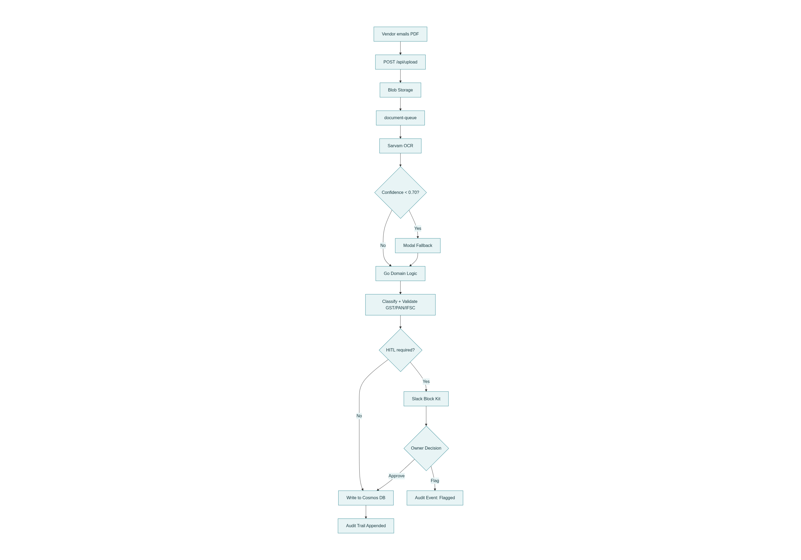

# OpsCore

Every B2B business owner starts as a craftsperson — a trader, a service expert. At five employees, the back-office collapses. Invoice processing, vendor ID verification, GST compliance — these are not skilled tasks, but they consume skilled people. OpsCore replaces the manual back-office with a system that produces identical results every time, with no human in the loop except for the final approval decision.

**Loom walkthrough:** *(coming soon)*

---

## How It Works

```
You upload a PDF invoice
  → Go validates GST/PAN/IFSC with regex (no LLM)
  → Deterministic risk score computed
  → If amount > ₹1L or low confidence → Slack approval request
  → Owner clicks [Approve] → done
```

**Three workflows:**
1. **Document Ingestion** — PDF → OCR → validation → Slack approval
2. **Vendor Onboarding** — form → risk scoring → Trust Battery → approval
3. **Compliance Monitoring** — RSS scraper → gap analysis → Slack alert

---

## Architecture



| Layer | Technology |
|-------|------------|
| Language | Go 1.22+ |
| Deployment | Docker container (any cloud) |
| Database | PostgreSQL 16 |
| Storage | MinIO / S3-compatible |
| Queue | Redis 7 |
| OCR | Sarvam Document Intelligence |
| LLM | Sarvam-M (used only when OCR confidence < 0.85) |
| HITL | Slack Block Kit |

---

## Quick Start

```bash
# 1. Clone
git clone https://github.com/Aparnap2/opscore.git
cd opscore

# 2. Configure
cp .env.example .env
# Fill in: DATABASE_URL, S3_ENDPOINT, S3_ACCESS_KEY, S3_SECRET_KEY, REDIS_ADDR, SARVAM_API_KEY

# 3. Start services
docker compose up -d

# 4. Create database tables
go run ./cmd/migrate

# 5. Start server
go run ./cmd/server

# 6. Test
curl http://localhost:8080/health
```

---

## API Endpoints

| Endpoint | Description |
|----------|-------------|
| `GET /api/health` | Health check (no auth) |
| `POST /api/upload` | Upload PDF (multipart/form-data) |
| `GET /api/jobs/{id}` | Get job status |
| `POST /api/vendors` | Create vendor request |
| `GET /api/vendors/{id}` | Get vendor status |
| `POST /api/slack/webhook` | Slack callbacks |

All endpoints except `/health` require `X-Tenant-ID` header.

---

## Deterministic Logic (No LLM)

| Decision | Implementation |
|----------|----------------|
| Document classification | `internal/domain/document_classifier.go` (keyword rules) |
| GST/PAN/IFSC validation | `internal/domain/india_validator.go` (regex) |
| Vendor risk scoring | `internal/domain/risk_scorer.go` (base 50 + adjustments) |
| Trust tier transitions | `internal/domain/trust_battery.go` (state machine) |

LLM is called only for: OCR confidence < 0.85 AND ambiguous fields.

---

## License

MIT